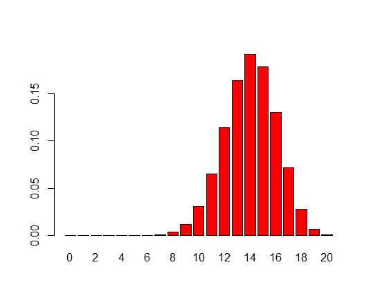
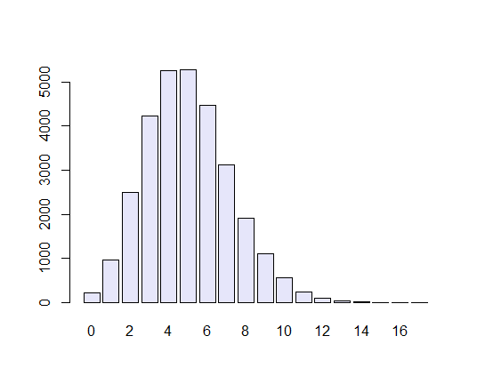

# 现代生物学中的现代统计学    
&nbsp;&nbsp;&nbsp;[地址](https://www.huber.embl.de/msmb/index.html)

## 引言

这本书的题目可以看出如今在生物数据分析中的两个革命性的变化：

1. 生物学，生物学数据更加异质和复杂。

2. 统计学，在20世纪是概率论和微积分的应用领域，多用于假设检验，现在数据分析、可视化、重采样、模拟、贝叶斯方法等等广泛的应用

任何生物系统有机体都是数以万计的的组件组成，它们可以处于不同的状态并以多种方式相互作用。现代生物学只在通过获取在时间和空间上多个变量之间的相互作用的的综合数据来理解生物系统，处理这些复杂的数据将是我们主要的挑战。

***同质的数据都是相似的，异质的数据各不相同*** ——安娜卡列尼娜

## 离散数据模型

1. 目标
   - 学习如何从给定的模型中获取到所有可能结果的概率以及如何比较观测到的数据和理论数据的频率
   - 泊松分布的使用
   - 如何从离散的数据中找到最有用的模型：泊松，二项，多项式
   - 使用R语言计算小事件的概率
   - 从指定的分布生成随机数据

2. 一个例子

   假如HIV病毒每一个复制周期，每个核酸突变率为5x$10^{-4}$,意味着一个复制循环之后突变在10000个核苷酸中突变的核苷酸数量服从泊松分布，频率为5.那么现在我们对HIV毒株中预期出现突变数量及其变异性有了基准参考值。

   假如我们想知道Poisson(5)模型下发生3个突变的频率，取$\lambda=5$

   `dpois(x = 3, lambda = 5)`

   ` 0.1403739`

   这表示恰好看到三个突变事件的概率为0.14，即大约七分之一

   如果我们想知道生成从0到12的所有值的概率

   `dpois(x = 3, lambda = 5)`

   `[1] 0.006737947 0.033689735 0.084224337 0.140373896 0.175467370
    [6] 0.175467370 0.146222808 0.104444863 0.065278039 0.036265577
   [11] 0.018132789 0.008242177 0.003434240`

3. 使用离散概率模型

   点突变可以发生，也可以不发生，这是一个二元事件。

   并不是所有的事件都是二元的。比如二倍体生物体中的基因型水平(AA,Aa,aa)

   分类变量的数目特别大，例如样本中不同的细菌种类，密码子的种类(64个水平)

   R对分类变量有个特殊的编码，称为**因子**(factor)。比如不同的血液基因型。

   `genotype = c("AA","AO","BB","AO","OO","BO","AO","AB","AO","OO","AB","BB")`

   `table(genotype)`

   `genotype
   AA AB AO BB BO OO 
    1  2  4  2  1  2 `

   在创建因子factor时，R会自动检测水平。可以使用level访问

   `genotypeF = factor(genotype)`

   `levels(genotypeF)`

   `"AA" "AB" "AO" "BB" "BO" "OO"`

   *问题：如果你想创建一个因子，而该因子的某些水平还不在你的数据中该怎么办？*

   *solution*

   **伯努利实验**

   抛一枚硬币，有两种可能，要么正面向上，要么反面向上。这是一个简单的伯努利实验。

   假设我们模拟15次伯努利实验，第一个参数为我们想要观察的实验次数，硬币为正面向上的概率，size=1表示每个单独的实验只包括一次抛硬币

   `rbinom(15,size = 1,prob = 0.5)`
   
   `1 1 1 0 1 1 1 0 0 0 1 1 0 1 1`
   
   再抛一次
   
   `rbinom(15,size = 1,prob = 0.5)`
   
   ` 1 0 0 1 0 1 0 0 1 1 1 0 0 1 0`
   
   每次试验的结果是不一样的
   
   假如现在概率不相等，正面的概率为0.7
   
   `rbinom(15,size = 1,prob = 0.7)`
   
   `1 1 1 1 1 0 1 1 0 1 1 1 0 0 1`
   
   **二项式计数**
   
   假设我们关心有多少出现正面的情况，而不关心顺序，我们可以将size设置为12
   
   `rbinom(1,prob = 0.7,size = 12)`
   
   `10`
   
   表示12次实验10次正面向上
   
   下面我们获得实验20次，完整的概率质量分布：
   
   `probabilities = dbinom(0:20,prob = 0.7,size = 20)
   barplot(probabilities,names.arg = 0:20,col = "red")`
   
   
   
   输出$X$属于二项分布$X\sim B(n,p)$
   
   
   
   **泊松分布**
   
   当二项分布中的试验次数n比较大，事件A在一次试验中发生的概率p比较小时，二项分布的一个事件发生次数的概率可以用泊松分布的概率来模拟。二项分布$B(n,p)$可以近似为泊松分布$(\lambda=np)$,与二项分布不同，泊松分布不再依赖于两个单独的参数$n$和$p$，而是$np$。
   $$
   \begin{aligned} 
   &\lim\limits_{n\to \infty,p\to0}\binom{n}{k}p^k(1-p)^{n-k} \\
    
   & =\lim\limits_{n\to \infty,p\to0}\frac{n^k}{k!}p^k(1-p)^{\frac{\lambda}{p}-k}\\
   &=\lim\limits_{n\to \infty,p\to0}\frac{\lambda^k}{k!}[(1-p)^{\frac{1}{-p}}]^{-\lambda}\frac{1}{(1-p)^k}\\
   &=\lim\limits_{n\to \infty,p\to0}\frac{\lambda^k}{k!}e^{-\lambda}
   \end{aligned}
   $$
   
   $$
   P(X=k)=\frac{\lambda^ke^{-\lambda}}{k!}
   $$
   计算$\lambda=5$时$P(X=3)$
   
   `5^3 * exp(-5) / factorial(3)`
   
   `0.1403739`
   
   假设现在有10000个位点的核酸序列，突变率为$5$x$10^{-4}$，计算出突变的核酸数目。
   
   画出概率分布条形图
   
   `rbinom(1,prob = 5e-4,size = 10000)`
   
   `6`
   
   `simulations = rbinom(n = 30000,prob = 5e-4,size = 10000)
   barplot(table(simulations),col = "lavender")`
   
   
   
   
   
   
   
   
   
   
   
   
   
   

## 统计模型
## R绘图
## 混合模型
## 聚类
## 测试
## 多元分析
## 高通量数据
## 异质数据
## 网络和树
## 图像数据
## 监督学习
## 高通量实验设计及分析