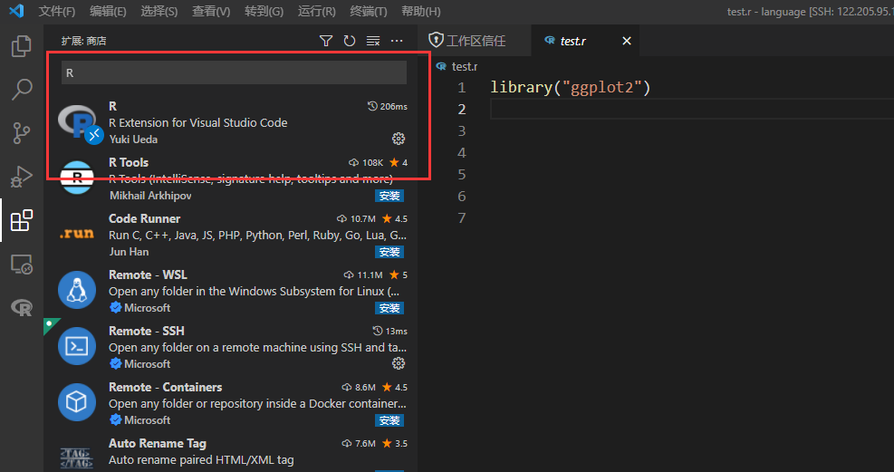

## gcc升级

centos的缺点就是东西比较老，很多时候用一些软件会有莫名其妙的版本问题

我们装一个gcc7.5，至于其他版本的，方法都是一样的

**不需要root**

首先到[gnu](https://ftp.gnu.org/gnu/gcc/gcc-7.5.0/)网站上下载对应的gcc版本，我下载的是7.5版本

```shell
mkdir gcc&&cd gcc

wget https://ftp.gnu.org/gnu/gcc/gcc-7.5.0/gcc-7.5.0.tar.gz --no-check-certificate

tar -zxvf gcc-7.5.0.tar.gz

cd gcc-7.5.0
```


**下载gcc依赖，十分重要**

```shell
./contrib/download_prerequisites
```

建一个build文件夹

```shell
mkdir gcc-build-7.5.0

cd  cd gcc-build-7.5.0/
```

检查是否能够make

```shell
../configure -enable-checking=release -enable-languages=c,c++ -disable-multilib
```

make的时候一定要指定线程数，就搞32个吧，如果不指定，干5个小时也是有可能的

```shell
make -j32
```

指定位置安装，否则会安装到root用户下,我们建一个自己家目录下的文件夹

```shell
mkdir /beegfs/home/rlong/soft/gcc/gcc-install-7.5.0
make DESTDIR=/beegfs/home/rlong/soft/gcc/gcc-install-7.5.0 install
```

然后install

```shell
make DESTDIR=/beegfs/home/rlong/soft/gcc/gcc-install-7.5.0 install
```

这样gcc就安装成功了，修改一下环境变量就行了

```shell
vim ~/.bashrc
```

把刚才DESTDIR里面的路径添加一下，这里是我自己的路径,修改的时候最好先做好备份(.bashrc.bak)，出了问题再替换回来

```shell
export LD_LIBRARY_PATH=/beegfs/home/rlong/soft/gcc/gcc-install-7.5.0/usr/local/lib64:$LD_LIBRARY_PATH
export PATH=/beegfs/home/rlong/soft/gcc/gcc-install-7.5.0/usr/local/bin:$PATH
```

最后

```shell
source ~/.bashrc
```

查看gcc版本

```shell
gcc -v
```


## 使用vscode进行远程开发

## 以R语言为例

### 1.VScode <u>[下载](https://code.visualstudio.com/)</u>，vscode是微软开源的一款开发用软件，下载好之后直接安装就好。

### 2.Remote-SSH插件安装，安装好之后左侧会有一个远程资源管理器，电脑屏幕的图标(下图第三步)。


### 3.R语言插件安装

### 4.添加远程服务器，使用ssh命令进入服务器就行了 ，比如：ssh rlong@122.205.95.XXX，回车，主机地址就会被添加到左边的SSH TARGETS中


### 5.右键服务地址，根据提示选择一个(我建议打开一个新窗口)，然后选择远程主机的操作系统，输入密码就进入连上远程服务了。左下角有显示


步骤从左到右


这时候我们已经连接到了linux服务，可以畅快的遨游了。

我们在写R代码之前，先在远程服务安装一个[R包](https://github.com/REditorSupport/vscode-R/wiki/R-Language-Service)，注意我们R的版本必须在3.4以上

我们先新建一个文件，然后在终端进入R环境，输入

```R
install.packages("languageserver")
```


或者自己在服务器下载

到这里基本就大功告成了。

我们看一下效果

（绘图）


（查看数据）


但是，还有个小小的问题，现在每次打开都要输入密码，很麻烦。解决也很简单，把自己的公钥给服务器就行了。可自行百度，这个不是我们讨论的重点

