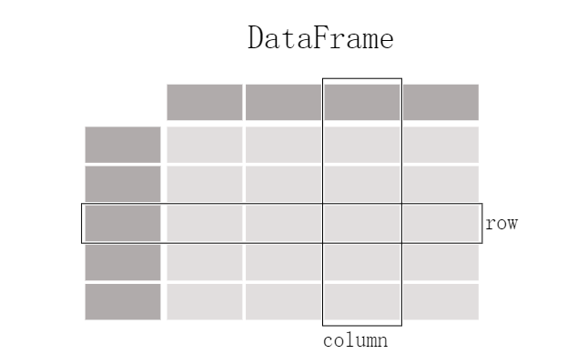
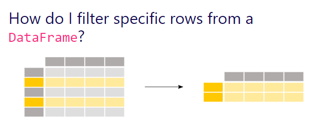

## 一天搞定numpy
**一门语言的流行，必要条件就是有杀手级别的框架和库。**

[numpy](https://numpy.org/)

```python
import numpy as np

# 从已有数据中创建数组
##列表转换成ndarray
lst1 = [3.14, 2.17, 0, 1, 2, ]
nd1 = np.array(lst1)
print(nd1)

##嵌套列表转换成多为ndarray
lst2 = [[3.14, 2.17, 0, 1, 2, ], [1, 2, 3, 4, 5, ]]
nd2 = np.array(lst2)
print(nd2)
print(type(nd2))

# 利用random 模块生成数组
# np.random.random 0-1之间的随机数
# np.random.uniform 均匀分布的随机数
# np.random.randn 标准正态的随机数
# np.random.randint 随机整数
# np.random.normal 正态分布
# np.random.shuffle 随机打乱顺序
# np.random.seed

nd3 = np.random.random([3, 3])
print(nd3.shape)

np.random.seed(123)
nd4 = np.random.randn(2, 3)
print(nd4)
np.random.shuffle(nd4)
np.zeros([3, 3])

nd5 = np.zeros([3, 3])
nd6 = np.ones([3, 3])
nd7 = np.eye(3)  # 单位
nd8 = np.diag([1, 2, 3])
nd9 = np.ones_like(nd5)

# 把数据保存起来，以后使用
nd10 = np.random.random([5, 5])
np.savetxt(X=nd10, fname='./test1.txt')
nd11 = np.loadtxt('./test1.txt')
print(nd11)

# 利用arange、linspace 函数生成数组
# arrange([start,] stop[,stop],dtype=None)
print(np.arange(10))

# [0 1 2 3 4 5 6 7 8 9]

print(np.arange(0, 10))
# [0 1 2 3 4 5 6 7 8 9]

print(np.arange(1, 4, 0.5))
# [1.  1.5 2.  2.5 3.  3.5]

# linspace 也是numpy模块中常用的函数，其格式为
# np.linspace(start, stop, num=50, endpoint=True, retstep=False, dtype=None)
print(np.linspace(0, 1, 10))
# [0.         0.11111111 0.22222222 0.33333333 0.44444444 0.55555556
# 0.66666667 0.77777778 0.88888889 1.        ]

print(np.linspace(0.1, 1, 10))
# [0.1 0.2 0.3 0.4 0.5 0.6 0.7 0.8 0.9 1. ]

# 获取元素
import numpy as np

np.random.seed(2019)
nd11 = np.random.random([10])
# 获取指定位置的数据，获取第4个元素
nd11[3]
# 截取一段数据
nd11[3:6]
# 截取固定间隔数据
nd11[1:6:2]
# Out[32]: array([0.39308051, 0.6378774 , 0.29917202])
# 倒序取数
nd11[::-2]
# [0.4057498  0.90320616 0.29917202 0.6378774  0.39308051]
# 截取一个多维数组的一个区域内数据
nd12 = np.arange(25).reshape([5, 5])
nd12[1:3, 1:3]
# array([[ 6,  7],
#       [11, 12]])
# 截取一个多维数组中，数值在一个值域之内的数据

nd12[(nd12 > 3) & (nd12 < 10)]
# array([[ 6,  7],
#       [11, 12]])

# 截取多维数组中，指定的行,如读取第2,3行
nd12[[1, 2]]  # 或nd12[1:3,:]

##截取多维数组中，指定的列,如读取第2,3列
nd12[:, 1:3]

from numpy import random as nr

a = np.arange(1, 25, dtype=float)
c1 = nr.choice(a, size=(3, 4))  # size指定输出数组形状
c2 = nr.choice(a, size=(3, 4), replace=False)  # replace缺省为True，即可重复抽取。
# 下式中参数p指定每个元素对应的抽取概率，缺省为每个元素被抽取的概率相同。
c3 = nr.choice(a, size=(3, 4), p=a / np.sum(a))
print("随机可重复抽取")
print(c1)
print("随机但不重复抽取")
print(c2)
print("随机但按制度概率抽取")
print(c3)

# numpy 的算术运算
# 涉及大量的数组或矩阵运算，这节我们重点介绍两种常用的运算。一种是对应元素相乘，
# 又称为逐元乘法(element-wise product)，运算符为np.multiply(), 或 *。
# 另一种是点积或内积元素，运算符为np.dot()。


# 对应元素相乘（element-wise product）是两个矩阵中对应元素乘积。
# np.multiply 函数用于数组或矩阵对应元素相乘，输出与相乘数组或矩阵的大小一致，其格式如下:

# numpy.multiply(x1, x2, /, out=None, *, where=True,casting='same_kind',
# order='K', dtype=None, subok=True[, signature, extobj])

X = np.random.rand(2, 3)


def softmoid(x):
    return 1 / (1 + np.exp(-x))


def relu(x):
    return np.maximum(0, x)


def softmax(x):
    return np.exp(x) / np.sum(np.exp(x))


print("输入参数X的形状：", X.shape)
print("激活函数softmoid输出形状：", softmoid(X).shape)
print("激活函数relu输出形状：", relu(X).shape)
print("激活函数softmax输出形状：", softmax(X).shape)

# 数组通过一些激活函数后，输出与输入形状一致。

##点积运算
A = np.array([[1, 2], [-1, 4]])
B = np.array([[2, 0], [3, 4]])
np.dot(A, B)
# array([[ 8,  8],
#       [10, 16]])

# 数组变形
# 更改数组的形状
# arr.reshape 重新将arr维度进行改变，不修改向量本身
# arr.resize  resize将arr维度进行改变，修改向量本身
# arr.T       不修改向量本身
# arr.ravel    对向量arr进行展平，即将多为数组变成一维数组，不会产生原数组的副本
# arr.flatten  对向量arr进行展平，即将多为数组变成一维数组，返回原数组的副本
# arr.squeeze   把矩阵中含1的维度去掉
# arr.transpose

arr = np.arange(10)
arr
# Out[68]: array([0, 1, 2, 3, 4, 5, 6, 7, 8, 9])
arr.reshape(2, 5)
# Out[69]:
# array([[0, 1, 2, 3, 4],
#       [5, 6, 7, 8, 9]])
arr
# Out[70]: array([0, 1, 2, 3, 4, 5, 6, 7, 8, 9])
arr.reshape(5, -1)
# Out[71]:
# array([[0, 1],
#       [2, 3],
#       [4, 5],
#       [6, 7],
#       [8, 9]])
arr.reshape(-1, 5)
# Out[72]:
# array([[0, 1, 2, 3, 4],
#       [5, 6, 7, 8, 9]])

##resize
arr.resize(2, 5)
print(arr)
##[[0 1 2 3 4]
# [5 6 7 8 9]]

##转置
arr = np.arange(12).reshape(3, 4)
# 向量 arr 为3行4列
print(arr)
# 将向量 arr 进行转置为4行3列
print(arr.T)

# ravel
arr = np.arange(6).reshape(2, -1)
print(arr)
# 按照列优先，展平
print("按照列优先，展平")
print(arr.ravel('F'))
# 按照行优先，展平
print("按照行优先，展平")
print(arr.ravel())

##flatten
# 把矩阵转换为向量，这种需求经常出现在卷积网络与全连接层之间。
a = np.floor(10 * np.random.random((3, 4)))
print(a)
print(a.flatten())

##squeeze
# 这是一个重要用来降维的函数，把矩阵中含1的维度去掉。
# 在Pytorch中还有一种与之相反的操作，torch.unsqueeze这个后面将介绍。
arr =np.arange(3).reshape(3, 1)
print(arr.shape)  #(3,1)
print(arr.squeeze().shape)  #(3,)
arr1 =np.arange(6).reshape(3,1,2,1)
print(arr1.shape) #(3, 1, 2, 1)
print(arr1.squeeze().shape) #(3, 2)

##transpose
#对高维矩阵进行轴对换，这个在深度学习中经常使用，
# 比如把图片表示颜色的RGB顺序，改为GBR的顺序
arr2 = np.arange(24).reshape(2,3,4)
print(arr2.shape)
#(2, 3, 4)
arr2.transpose(2,0,1)
'''
array([[[ 0,  4,  8],
        [12, 16, 20]],
       [[ 1,  5,  9],
        [13, 17, 21]],
       [[ 2,  6, 10],
        [14, 18, 22]],
       [[ 3,  7, 11],
        [15, 19, 23]]])
'''
arr2.transpose(2,0,1).shape
#(4, 2, 3)
#合并数组
# np.append 内存占用大
# np.concatenate 没有内存问题
# np.stack 沿着新的轴假如一系列数组
# np.hstack 堆栈数组垂直顺序(行)
# np.vstack 堆栈数组垂直顺序(列)
# np.dstack 堆栈数组按顺序深入(沿第三维)
# np.vsplit 将数组分解成垂直的多个子数组的列表

#[说明]
#append、concatnate以及stack都有一个 axis 参数，用于控制数组合并是按行还是按列。
#对于append和concatnate，待合并的数组必须有相同的行数或列数(满足一个即可)。
#stack、hstack、dstack待合并的数组必须具有相同的形状( shape)。

a = np.array([1,2,3])
b = np.array([4,5,6])
np.append(a,b)
#Out[10]: array([1, 2, 3, 4, 5, 6])

a = np.arange(4).reshape(2,2)
b = np.arange(4).reshape(2,2)
c = np.append(a,b)
c
#Out[14]: array([0, 1, 2, 3, 0, 1, 2, 3])
c = np.append(a,b,axis=0)
c
#Out[16]:
#array([[0, 1],
#       [2, 3],
#       [0, 1],
#       [2, 3]])
c = np.append(a,b,axis=1)
c
#Out[18]:
#array([[0, 1, 0, 1],
#       [2, 3, 2, 3]])

#按行合并
c = np.concatenate((a,b),axis=0)
c
#Out[21]:
#array([[0, 1],
#       [2, 3],
#       [0, 1],
#       [2, 3]])
#按列合并
c = np.concatenate((a,b),axis=1)
c
#Out[23]:
#array([[0, 1, 0, 1],
#       [2, 3, 2, 3]])


#stack
#沿指定轴堆叠数组或矩阵
a = np.array([[1,2],[3,4]])
b = np.array([[5,6],[7,8]])
c = np.stack((a,b),axis = 0)
c
#Out[29]:
#array([[[1, 2],
#        [3, 4]],
#       [[5, 6],
#        [7, 8]]])
c = np.stack((a,b),axis = 1)
c
#Out[31]:
#array([[[1, 2],
#        [5, 6]],
#       [[3, 4],
#        [7, 8]]])

##批量处理
data_train = np.random.randn(10000,2,3)
print(data_train.shape)
np.random.shuffle(data_train)
batch_size = 100
for i in range(0,len(data_train),batch_size):
    x_batch_sum = np.sum(data_train[i:i+batch_size])
    print("第{}批次，该批次数据之和{}".format(i,x_batch_sum))

###通用函数 universal function
#sqrt
# sin cos
# abs
# dot
# log log10,log2
# exp
# cumsum,cumproduct 累计求和，求积
# sum
# mean
# median
# std
# var
# corrcoef 计算相关系数
import time
import numpy as np

x1 = np.random.rand(1000000)
x2 = np.random.rand(1000000)
##使用循环计算向量点积
tic = time.process_time()
dot = 0
for i in range(len(x1)):
    dot+= x1[i]*x2[i]
toc = time.process_time()
print ("dot = " + str(dot) + "\n for loop----- Computation time = " + str(1000*(toc - tic)) + "ms")
##使用numpy函数求点积
tic = time.process_time()
dot = 0
dot = np.dot(x1,x2)
toc = time.process_time()
print ("dot = " + str(dot) + "\n verctor version---- Computation time = " + str(1000*(toc - tic)) + "ms")


#广播机制
#NumPy的Universal functions 中要求输入的数组shape是一致的，
# 当数组的shape不相等的时候，则会使用广播机制。不过，调整数组使得shape一样，
# 需满足一定规则，否则将出错。
#1.所有输入数组的shape都向shape最长的数组看齐，shape中不足的部分都通过在前面加1补齐
#例如 a:2x3x2 b 3x2，则b向a看齐，在b的前面加1：变为1x3x2
#2输出数组的shape是输入数组shape的各个轴上的最大值
#3如果输入数组的某个轴和输出数组的对应的长度相同或者其长度为1时，这个数组能用来计算，否则出错
#4当输入数组的某个轴长度为1时，沿着此轴运算时都用(或复制)此轴上的第一组值
A = np.arange(0,40,10).reshape(4,1)
B = np.arange(0,3)
print(A.shape,B.shape)
C = A+B
print(C)
```
## 两天搞定pandas

pandas 是一个[Python](https://www.python.org/)包，提供快速、灵活和富有表现力的数据结构，使数据处理变得既简单又直观。

pandas主要包含两个数据结构DataFrame和Series

| Dimensions | Name      | Description                                                  |
| ---------- | --------- | ------------------------------------------------------------ |
| 1          | Series    | 1D homogeneousy-typed array                                  |
| 2          | DataFrame | General 2D labeled,size-mutable tabular structure with potentially heterogeneously-typed column |


### pandas处理什么样的数据

`import pandas as pd`



DataFrame的数据结构很像sql的一张表

**创建一个DataFrame**

```python
df = pd.DataFrame(
   ...:     {
   ...:         "Name": [
   ...:             "Braund, Mr. Owen Harris",
   ...:             "Allen, Mr. William Henry",
   ...:             "Bonnell, Miss. Elizabeth",
   ...:         ],
   ...:         "Age": [22, 35, 58],
   ...:         "Sex": ["male", "male", "female"],
   ...:     }
   ...: )
   ...: 
        
```

`df`

```
 Name  Age     Sex
0   Braund, Mr. Owen Harris   22    male
1  Allen, Mr. William Henry   35    male
2  Bonnell, Miss. Elizabeth   58  female
```

df的每一列都是一个Series，前面说过Series是一维的

`df['Age']`

`0    22
1    35
2    58
Name: Age, dtype: int64`

`ages = pd.Series(data=[22,35,58],name = 'Age')`

我们看一看pandas的构造器

``

```
def __init__(
    self,
    data=None,
    index: Optional[Axes] = None,
    columns: Optional[Axes] = None,
    dtype: Optional[Dtype] = None,
    copy: bool = False,
)
```

可以看出pandas有几个关键的参数：data，index，columns，dtype，copy

分别看看这几个参数的解释：

```
data : ndarray (structured or homogeneous), Iterable, dict, or DataFrame
    Dict can contain Series, arrays, constants, or list-like objects.
index : Index or array-like
    Index to use for resulting frame. Will default to RangeIndex if
    no indexing information part of input data and no index provided.
columns : Index or array-like
    Column labels to use for resulting frame. Will default to
    RangeIndex (0, 1, 2, ..., n) if no column labels are provided.
dtype : dtype, default None
    Data type to force. Only a single dtype is allowed. If None, infer.
copy : bool, default False
    Copy data from inputs. Only affects DataFrame / 2d ndarray input.
```

一个小小的练习

```python
data={'name':['zhanghua','liuting','gaofei','hedong'],'age':[40,45,50,46],'addr':['jianxi','pudong','beijing','xian']}

d2=DataFrame(data)
#改变列的次序
d3=DataFrame(data,columns=['name','age','addr'],index=['a','b','c','d'])
d3
```

       name  age     addr
```python
a  zhanghua   40   jianxi
b   liuting   45   pudong
c    gaofei   50  beijing
d    hedong   46     xian
```

**获取数据**

`d3[['name']]` #选取某一列

`d3[['name','age']]`#选取多列

`d3[1:3]` #选取多行

`d3['a':'c']` #选取多行

```python
data = [[1,2,3],[4,5,6],[7,8,9]]

index = ['a','b','c']

columns = ['c1','c2','c3']

df = pd.DataFrame(data=data,index = index ,columns = columns)
```

使用obj.loc[]或者obj.iloc[]获取行或者列数据

loc通过行标签获取行数据，iloc通过行号获取行数据

loc在index的标签上进行索引，范围包括start和end

iloc在index的位置上进行索引，不包括end

```python
#############loc的使用###############

df.loc[['a','b']]       #通过行标签获取行数据

df.loc[['a'],['c1','c3']]   #通过行标签、列名称获取行列数据

df.loc[['a','b'],['c1','c3']] #通过行标签、列名称获取行列数据

################iloc的使用###################

df.iloc[1]           #通过行号获取行数据

df.iloc[0:2]          #通过行号获取行数据，不包括索引2的值

df.iloc[1:,1]         ##通过行号、列行获取行、列数据

df.iloc[1:,[1,2]]       ##通过行号、列行获取行、列数据

df.iloc[1:,1:3]        ##通过行号、列行获取行、列数据
```

**修改数据**

```python
data={'name':['zhanghua','liuting','gaofei','hedong'],'age':[40,45,50,46],'addr':['jianxi','pudong','beijing','xian']}

d3=DataFrame(data,columns=['name','age','addr'],index=['a','b','c','d'])

d3
```

`d3.drop('d',axis=0)`

drop并不会修改原df的值


求最大年龄

`df['Age'].max()`

`58`

或者对于Series，直接

`ages.max()`

`58`

假如我们对统计感兴趣

`df.describe()`

`                       Age
count   3.000000
mean   38.333333
std    18.230012
min    22.000000
25%    28.500000
50%    35.000000
75%    46.500000
max    58.000000`             

pandas 读写数据


**如何从DataFrame中过滤出指定列**


`

```python
ages = titanic["Age"]

ages.head()

type(titanic["Age"])

pandas.core.series.Series
```

`titanic["Age"].shape`

`age_sex = titanic[["Age","Sex"]]`

```python
type(titanic[["Age","Sex"]])

pandas.core.frame.DataFrame
```

可以看出age_sex是一个DataFrame

**如何从DataFrame中过滤出特定的行？**



选择年龄大于35的人

```python
above_35 = titanic[titanic["Age"]>35]

above_35.head()
```

查看二号仓和三号仓的人

```python
class_23 = titanic[titanic["Pclass"].isin([2,3])]

class_23.head()

class_23.shape
```


## 三天搞定pytorch

## 一周搞定机器学习
